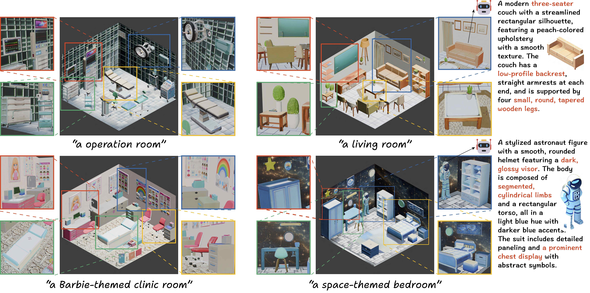

<div align="center">
<h1>ArtiScene: Language-Driven Artistic 3D Scene Generation Through Image Intermediary</h1>
🏡🏢🏦 A text-to-3D scene generation system that generalizes to diverse scene styles and categories. 💒🏛⛪️
</div>

<p align="center">
  🔬 <a href="https://research.nvidia.com/labs/dir/artiscene/"><b>NVIDIA Research</b></a> |
  📜 <a href="https://artiscene-cvpr.github.io/"><b>Project Page</b></a> |
  💡 <a href="https://arxiv.org/abs/2506.00742"><b>arXiv</b></a> |
  📄 <a href="https://cvpr.thecvf.com/virtual/2025/poster/33257"><b>CVPR 2025</b></a> |
  📖 <a href="#-cite"><b>Citation</b></a> <br>
</p>

<div align="center">

</div>

## 💪 Getting started
 ~~~
git clone https://gitlab-master.nvidia.com/zeqig/artiscene.git
conda create --name artiscene python=3.10
conda activate artiscene
pip install -r requirements.txt
 ~~~
Install detectron2==0.6, groundingdino==0.1.0, mask2former==0.1, odise==0.1, panopticapi==0.1, sd-dino==0.0.0 and stable-diffusion-sdkit following:<br>
https://detectron2.readthedocs.io/en/latest/tutorials/install.html<br>
https://github.com/IDEA-Research/GroundingDINO<br>
https://github.com/facebookresearch/MaskFormer<br>
https://github.com/NVlabs/ODISE<br>
https://github.com/Junyi42/sd-dino<br>
git clone Inpaint-Anything and Pix2Gestalt as folders parallel to this one.<br>
https://github.com/geekyutao/Inpaint-Anything<br>
https://github.com/cvlab-columbia/pix2gestalt<br>
For reference, package_conda.txt lists all conda packages.<br>
 ~~~
#use your ChatGPT API key
export OPENAI_API_KEY=
 ~~~

## 🚀 Steps
Put your image into a result folder of name $SCENE_NAME, renamed to input.png.<br>
SCENE_CATEGORY is the scene category of this scene.<br>
Let's use the <em>bathroom_example</em> folder as an example:<br>
 ~~~
export SCENE_NAME=bathroom_example
export SCENE_CATEGORY=bathroom
~~~
Now let's start!<br>
### Step 0
~~~
python step0_GPT_common_things.py --scene_category $SCENE_CATEGORY
 ~~~
After this there should be $SCENE_CATEGORY_furnitures.txt and $SCENE_CATEGORY_small_objects.txt in <em>common_objects_scenes</em>
### Step 1
 ~~~
python step1_first_detect_together.py --suffix together_1 --image_path $SCENE_NAME/input.png --scene_category $SCENE_CATEGORY

python step1_first_detect_together.py --suffix together_2 --image_path $SCENE_NAME/inpainted_together_1.png --scene_category $SCENE_CATEGORY
 ~~~
### Step 2
These two commands could be run in parallel:
 ~~~
python step2_describe_object.py --image_path $SCENE_NAME/input.png --seg_rgb_folder_stem small_objects_cropped_seg_rgb_together_ --seg_rgb_folder_suffix 1,2

python step2_describe_object.py --image_path $SCENE_NAME/inpainted_together_2.png --seg_rgb_folder_stem furnitures_cropped_seg_rgb_together_ --seg_rgb_folder_suffix 2
 ~~~
At this time the folder should contain all combinations of the following prefix, folder name stem, and suffix:<br>
{all, furnitures, small_objects} X
{\_bbox_together_, \_cropped_seg_rgb_together_, \_cropped_seg_together_, \_cropped_together_, \_seg_together_} X
{1, 2, 12}
### Step 3
 ~~~
python step3_depth_bbox_pipeline.py --erosion_kernel 5 --input_image $SCENE_NAME/input.png  --output_name small_objects_erode_5.ply --mask_folders small_objects_seg_together_merged_12

python step3_depth_bbox_pipeline.py --erosion_kernel 5 --input_image $SCENE_NAME/inpainted_together_2.png  --output_name furnitures_erode_5.ply --mask_folders furnitures_seg_together_merged_2
 ~~~
### Step 4
Now you can open the small_objects_erode_5.ply and furnitures_erode_5.ply files with your point cloud visualizer to see if the 3D point clouds are reasonable. If the overall point clouds tilts, consider adjust ''scale'' in args.
This step is optional. If most objects are not occluded, this step is not that necessary.
 ~~~
python step4_pix2gestalt.py --input_folder $SCENE_NAME

python step4_pick_inpainted.py --root_dir . --folders $SCENE_NAME
 ~~~

If you decide to skip this step (pix2gestalt), please place the segementaion rgb images with description json files in the same format as the outputs of running this step. You could do so by:
~~~
cd $SCENE_NAME
mkdir for_image_text23d
mkdir for_image_text23d/furnitures_merged_2_pix2gestalt
cp -r furnitures_cropped_seg_rgb_together_merged_2 for_image_text23d/furnitures_merged_2_pix2gestalt/images

cp furnitures_cropped_seg_rgb_together_merged_2.json for_image_text23d/furnitures_merged_2_pix2gestalt/

mkdir for_image_text23d/small_objects_merged_12 
cp -r small_objects_cropped_seg_rgb_together_merged_12 for_image_text23d/small_objects_merged_12/images

mv small_objects_cropped_seg_rgb_together_merged_12.json for_image_text23d/small_objects_merged_12/
~~~
Regardless of whether you skip this pix2gestalt, the for_image_text23d should now contain:<br>
furnitures_merged_2_pix2gestalt<br>
---furnitures_cropped_seg_rgb_together_merged_2.json<br>
---images subfolder<br>

small_objects_merged_12<br>
----small_objects_cropped_seg_rgb_together_merged_12.json<br>
----images subfolder<br>
### Step 5
~~~
python step5_wall_floor.py --root_dir . --folders $SCENE_NAME
~~~
If DALLE's generated images cannot be downloaded, please check your machine's Internet settings

### Step 6
These two commands could be run in parallel:
~~~
python step6_image_text23d.py --root_dir . --folders $SCENE_NAME

python step6_image_text23d_small.py --root_dir . --folders $SCENE_NAME
~~~
After both, unzip all generated files:
~~~
python step6_unzip.py --folder $SCENE_NAME
~~~
### Step 7
These two steps could be run in parallel, on two separate GPUs:
~~~
python step7_pose_match.py --image_path $SCENE_NAME/inpainted_together_2.png --match_by feat_sd_dino --crop_size 1.2 --image_folder for_image_text23d/furnitures_merged_2_pix2gestalt --mask_folder furnitures_seg_together_merged_2

python step7_pose_match.py --image_path $SCENE_NAME/input.png --match_by feat_sd_dino --crop_size 1.2 --image_folder for_image_text23d/small_objects_merged_12 --mask_folder small_objects_seg_together_merged_12
~~~
### Step 8
Now you've got everything for assembly! Download it to local computer with Blender and unzip it:
~~~
zip -r $SCENE_NAME.zip $SCENE_NAME/for_image_text23d $SCENE_NAME/feat_sd_dino_1.2_* $SCENE_NAME/input.png $SCENE_NAME/inpainted_together_2.png $SCENE_NAME/chosen.png $SCENE_NAME/floor.png
~~~
On your local computer, 
~~~
#make sure you have blender, e.g. pip install bpy==4.0.0
#use your ChatGPT API key
export OPENAI_API_KEY=
export SCENE_NAME=bathroom_example

python step8_set_pose_v3.py --root_dir $SCENE_NAME --furnitures_dict_file feat_sd_dino_1.2_furnitures_pred.json --save_name furnitures+objects --small_objects_image_folder for_image_text23d/small_objects_merged_12 --small_objects_dict_file feat_sd_dino_1.2_small_objects_pred.json
~~~
Now in $SCENE_NAME, you should see furnitures+objects.blend and rendered images in render folder!🥳

## 📄 Cite
```
@inproceedings{gu2025artiscene,
  title={ArtiScene: Language-Driven Artistic 3D Scene Generation Through Image Intermediary},
  author={Gu, Zeqi and Cui, Yin and Li, Zhaoshuo and Wei, Fangyin and Ge, Yunhao and Gu, Jinwei and Liu, Ming-Yu and Davis, Abe and Ding, Yifan},
  booktitle={Proceedings of the Computer Vision and Pattern Recognition Conference},
  pages={2891--2901},
  year={2025}
}
```